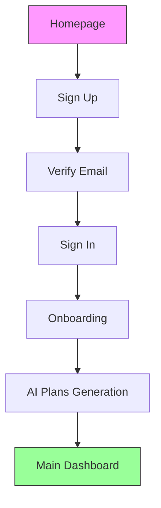
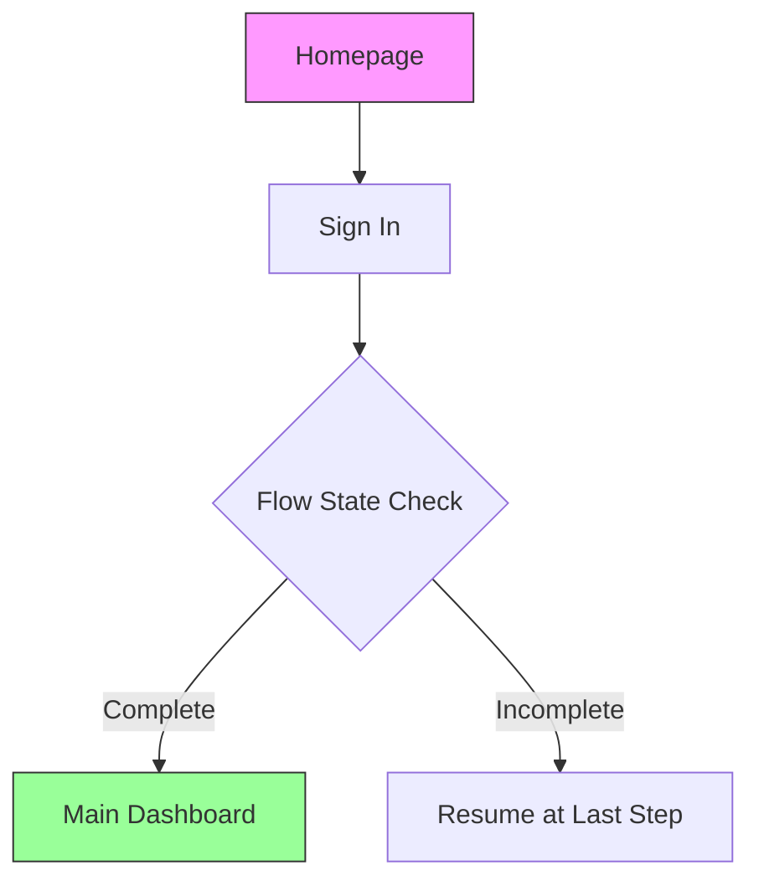
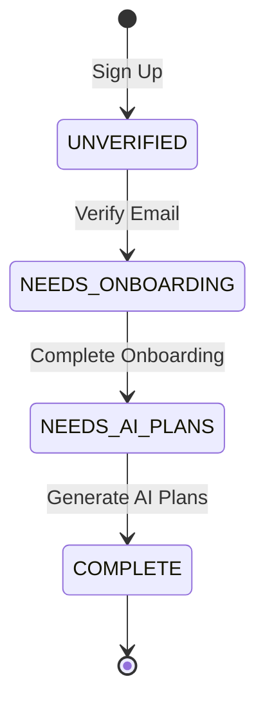

# User Flow Documentation

## Overview

This document describes the user authentication and onboarding flow in the Mission Fitness application. The flow ensures users complete necessary setup steps before accessing the full application.

## Flow States

The application uses a state-based flow system with the following states:

| State | Description | Next Route |
|-------|-------------|------------|
| `UNVERIFIED` | User has signed up but not verified email | `/verify-email` |
| `NEEDS_ONBOARDING` | Email verified, needs to complete onboarding | `/onboarding` |
| `NEEDS_AI_PLANS` | Onboarding complete, AI plans being generated | `/ai-plans` |
| `COMPLETE` | All steps complete, full access granted | `/main-dashboard` |

## User Journeys

### First-Time User Flow



**Steps:**
1. User visits homepage
2. User signs up with email and password
3. User receives verification email
4. User verifies email
5. User signs in
6. User completes onboarding form (fitness profile)
7. System generates AI-powered fitness plans
8. User gains access to main dashboard

### Returning User Flow



**Steps:**
1. User visits homepage
2. User signs in
3. System checks flow completion status
4. If complete: redirect to main dashboard
5. If incomplete: redirect to last incomplete step

## Technical Implementation

### Core Components

#### 1. Flow Service (`flow.service.js`)

Centralized service managing all flow logic:

- `determineFlowState(user, onboardingData)` - Determines current state
- `determineUserRoute(user, onboardingData)` - Gets next route
- `validateRouteAccess(user, path, onboardingData)` - Validates access
- `getUserFlowState(userId)` - Gets detailed state info
- `markFlowStepComplete(userId, step)` - Marks step complete

#### 2. Flow Middleware (`userFlow.js`)

Protects routes and enforces flow:

- `checkUserFlow` - Main middleware for route protection
- Validates user state before allowing access
- Redirects to appropriate route if access denied

#### 3. Flow Validation (`flowValidation.js`)

Additional validation middleware:

- `validateFlowState` - Ensures state consistency
- `requireFlowStep(step)` - Requires specific step completion
- `requireCompleteFlow` - Requires full flow completion

#### 4. Custom Errors (`flowErrors.js`)

Specific error types for flow issues:

- `FlowStateError` - Invalid/corrupted state
- `OnboardingIncompleteError` - Onboarding not complete
- `AIPlansRequiredError` - AI plans not generated
- `EmailNotVerifiedError` - Email not verified

### Database Schema

#### User Schema

```javascript
{
  userName: String,
  email: String,
  password: String,
  isVerified: Boolean,          // Email verification status
  onboardingCompleted: Boolean, // Full flow completion status
  // ... other fields
}
```

#### Onboarding Schema

```javascript
{
  userId: ObjectId,
  gender: String,
  age: Number,
  // ... fitness profile fields
  isComplete: Boolean,  // Onboarding form completion status
  // ... other fields
}
```

## Protected Routes

Routes are protected based on flow state requirements:

| Route | Required State | Middleware |
|-------|----------------|------------|
| `/onboarding` | `NEEDS_ONBOARDING` | `checkUserFlow` |
| `/ai-plans` | `NEEDS_AI_PLANS` or `COMPLETE` | `checkUserFlow` |
| `/main-dashboard` | `COMPLETE` | `checkUserFlow` |
| `/profile` | `COMPLETE` | `checkUserFlow` |
| `/daily-activity` | `COMPLETE` | `checkUserFlow` |

## API Endpoints

### Login

**POST** `/auth/log-in`

**Request:**
```json
{
  "userName": "string",
  "password": "string"
}
```

**Response:**
```json
{
  "message": "User logged in successfully",
  "user": {
    "_id": "string",
    "userName": "string",
    "email": "string",
    "isVerified": boolean,
    "onboardingCompleted": boolean
  },
  "token": "string",
  "redirectUrl": "string",
  "flowState": {
    "currentState": "string",
    "completionPercentage": number,
    "isComplete": boolean
  }
}
```

### Create Onboarding

**POST** `/api/onboarding`

**Headers:**
```
Authorization: Bearer <token>
```

**Request:**
```json
{
  "gender": "male|female|other",
  "age": number,
  "heightCm": number,
  "weightKg": number,
  "goal": "weight loss|muscle gain|maintenance|balanced|weight gain",
  // ... other fitness profile fields
}
```

**Response:**
```json
{
  "message": "Fitness profile created, AI-powered plan generated",
  "fitnessProfile": { /* ... */ },
  "aiPlan": { /* ... */ },
  "workoutPlan": { /* ... */ },
  "dietPlan": { /* ... */ }
}
```

## Flow State Transitions



## Error Handling

### Flow Errors

All flow-related errors extend `FlowError` and include:
- `message` - User-friendly error message
- `statusCode` - HTTP status code
- `userId` - User ID (if applicable)
- `requiredStep` - Required step (if applicable)

### Error Responses

```json
{
  "success": false,
  "error": "Error message",
  "errorType": "ErrorClassName",
  "statusCode": 403,
  "requiredStep": "onboarding",
  "redirectTo": "/onboarding"
}
```

## Logging

All flow operations are logged with:
- User ID
- Current state
- Action performed
- Duration (for performance monitoring)
- Error details (if applicable)

**Log Levels:**
- `INFO` - Normal flow operations
- `WARN` - Access denied, validation failures
- `ERROR` - Unexpected errors, state corruption
- `DEBUG` - Detailed state information

## Security Considerations

1. **Token Validation** - All protected routes require valid JWT
2. **State Validation** - Flow state checked on every request
3. **Access Control** - Users can't skip flow steps
4. **Error Handling** - Errors don't expose sensitive information
5. **Audit Logging** - All flow transitions logged

## Troubleshooting

### User Stuck in Flow

**Symptoms:** User can't progress to next step

**Solutions:**
1. Check user's flow state: `getUserFlowState(userId)`
2. Verify database records (User and Onboarding)
3. Check logs for errors during step completion
4. Manually mark step complete if needed

### Incorrect Redirect

**Symptoms:** User redirected to wrong page

**Solutions:**
1. Verify flow state determination logic
2. Check route protection middleware
3. Ensure database records are consistent
4. Review recent code changes to flow service

### State Corruption

**Symptoms:** Flow state inconsistent with database

**Solutions:**
1. Run state validation: `validateFlowState`
2. Check for partial updates (transaction failures)
3. Verify both User and Onboarding records
4. Reset user's flow state if necessary

## Testing

### Manual Testing Checklist

- [ ] New user can complete full flow
- [ ] Returning user redirects to dashboard
- [ ] User can't skip onboarding
- [ ] User can't access dashboard before completion
- [ ] Email verification enforced
- [ ] Interrupted flow can be resumed
- [ ] Error messages are user-friendly
- [ ] Logging captures all transitions

### Automated Tests

Tests should cover:
- Flow state determination
- Route access validation
- Step completion marking
- Error handling
- Edge cases (missing data, corrupted state)

## Future Enhancements

Potential improvements:
- Progress indicators in UI
- Flow state caching for performance
- Multi-step onboarding with save/resume
- Admin tools for flow management
- Analytics on flow completion rates
- A/B testing different flow variations
